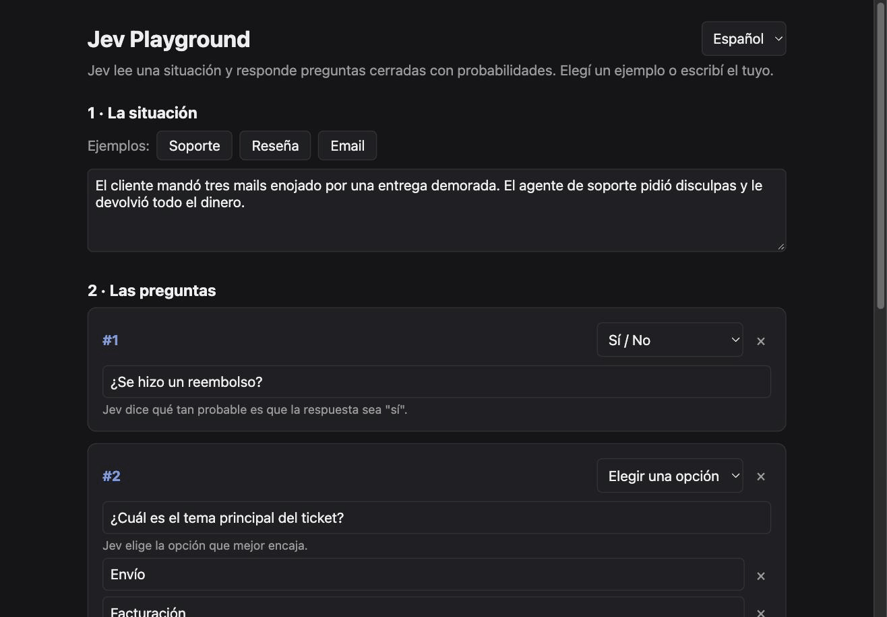

# Jev Playground

[English](README.md) | **Español**

Una app local mínima para probar [`typesafe-ai/jev`](https://vercel.com/ai-gateway/models/jev) a través de Vercel AI Gateway.

Jev no es un modelo de chat. Evalúa un **state** (texto o JSON) contra **preguntas tipadas** y devuelve probabilidades en lugar de texto libre.



## Acerca de Jev

Jev es un modelo de IA de TypeSafe AI, lanzado en septiembre de 2026. A diferencia de los chatbots, no genera texto. Le pasás una entrada, como un ticket de soporte o un log, junto con un conjunto de preguntas tipadas con respuestas predefinidas. Devuelve decisiones estructuradas (una opción, un puntaje o un sí/no) con una probabilidad para cada una, así tu código puede usar el resultado directamente sin parsear nada.

El nombre viene de William Stanley Jevons, el economista del siglo XIX cuya paradoja describe cómo la baja en el costo de un recurso puede llevar a que se use cada vez más. La apuesta de TypeSafe es que, si la inteligencia se vuelve muy barata, va a terminar estando en todos lados.

TypeSafe presenta a Jev como el primero de sus modelos System One, un concepto tomado de la distinción entre el pensamiento de Sistema 1 y Sistema 2 que popularizó Daniel Kahneman en *Pensar rápido, pensar despacio*. El Sistema 1 abarca las decisiones rápidas, intuitivas y casi automáticas; el Sistema 2, el razonamiento lento y deliberado. TypeSafe ubica a los LLM tradicionales en el segundo grupo y a Jev en el primero.

En la práctica, está pensado para decisiones rápidas, baratas y de alto volumen dentro del software: clasificar, rutear, puntuar y priorizar. Las respuestas llegan en menos de un segundo y su precio está muy por debajo de los LLM habituales. Las contras: no puede explicar su razonamiento, le cuestan los conteos y las fechas, y sus niveles de confianza todavía hay que validarlos contra tus propios datos antes de confiar en ellos.

## Requisitos

- Node 24+
- Una API key de Vercel AI Gateway

## Setup

```bash
cp .env.example .env   # completar AI_GATEWAY_API_KEY
npm i
npm start              # http://localhost:3000
```

Variables opcionales: `PORT` (por defecto `3000`) y `JEV_MODEL` (por defecto `typesafe-ai/jev`).

## Cómo usar el playground

1. **La situación**: escribí lo que pasó, o cargá uno de los ejemplos (Soporte, Reseña, Email).
2. **Las preguntas**: agregá preguntas con un formulario: elegí *Sí / No*, *Elegir una opción* o *Puntaje en escala* y escribí las opciones. No hace falta JSON.
3. **Preguntarle a Jev**: cada respuesta se muestra como un veredicto simple ("Sí · 98% de seguridad", "Enojado · 3/4") con una barra por opción.

La interfaz está en inglés y en español (selector arriba a la derecha, se recuerda entre visitas). El **Modo avanzado**, abajo de todo, muestra el request exacto que se envía al modelo y la respuesta cruda.

## Tipos de pregunta

| Tipo | `criteria` | Respuesta |
|---|---|---|
| `boolean` | opcional `{ true, false }` | `probability` (0–1) |
| `choice` | objeto `{ opcion: descripcion }` | `choice` + `probabilities` |
| `score` | array ordenado de niveles (2 o más) | `score` + `probabilities` |

`score` es la posición dentro del array `criteria`, empezando en 0 y ponderada por probabilidad (por ejemplo, `2.19` ≈ tercer nivel).

```json
{
  "refunded": { "type": "boolean", "instructions": "¿Se hizo un reembolso?" },
  "topic": {
    "type": "choice",
    "instructions": "¿Cuál es el tema principal?",
    "criteria": { "envio": "Problemas de entrega", "facturacion": "Pagos" }
  },
  "anger": {
    "type": "score",
    "instructions": "¿Qué tan enojado está el cliente?",
    "criteria": ["tranquilo", "molesto", "enojado", "furioso"]
  }
}
```

## API

`POST /evaluate` con `{ "state": ..., "questions": { ... } }` devuelve `answers`, `usage`, `warnings`, `modelId` y `ms`.

## Links

- [Jev en AI Gateway](https://vercel.com/ai-gateway/models/jev)
- [Documentación de TypeSafe](https://docs.typesafe.ai/introduction)

## Licencia

[MIT](LICENSE)
