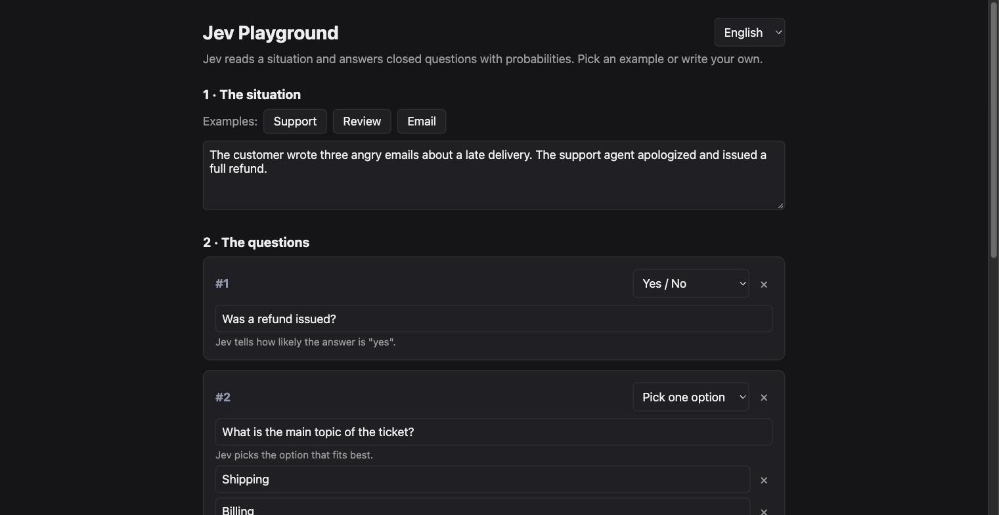

# Jev Playground

**English** | [Español](README.es.md)

A minimal local app to try [`typesafe-ai/jev`](https://vercel.com/ai-gateway/models/jev) through Vercel AI Gateway.

Jev is not a chat model. It evaluates a **state** (text or JSON) against **typed questions** and returns probabilities instead of free text.



## About Jev

Jev is an AI model from TypeSafe AI, launched in September 2026. Unlike chatbots, it doesn't generate text. You give it some input, like a support ticket or a log, plus a set of typed questions with predefined answers. It returns structured decisions (a choice, a score, or a yes/no) with a probability for each one, so your code can use the result directly without parsing anything.

The name comes from William Stanley Jevons, the 19th-century economist whose paradox describes how a falling cost can lead to a resource being used more and more. TypeSafe's bet is that if intelligence becomes dirt cheap, it will end up everywhere.

TypeSafe calls Jev the first of its System One models, a concept borrowed from the distinction between System 1 and System 2 thinking, popularized by Daniel Kahneman in *Thinking, Fast and Slow*. System 1 covers fast, intuitive, almost automatic decisions; System 2 is slow, deliberate reasoning. TypeSafe places traditional LLMs in the second group and Jev in the first.

In practice, it's built for fast, cheap, high-volume decisions inside software: classifying, routing, scoring, and triaging. Responses come back in under a second, and it's priced far below typical LLMs. The trade-offs are that it can't explain its reasoning, it struggles with counting and dates, and its confidence scores still need to be validated against your own data before you rely on them.

## Requirements

- Node 24+
- A Vercel AI Gateway API key

## Setup

```bash
cp .env.example .env   # fill in AI_GATEWAY_API_KEY
npm i
npm start              # http://localhost:3000
```

Optional variables: `PORT` (default `3000`) and `JEV_MODEL` (default `typesafe-ai/jev`).

## Using the playground

1. **The situation** — write what happened, or load one of the examples (Support, Review, Email).
2. **The questions** — add questions with a form: pick *Yes / No*, *Pick one option* or *Score on a scale* and type the options. No JSON needed.
3. **Ask Jev** — each answer is shown as a plain verdict ("Yes · 98% sure", "Angry · 3/4") with a bar per option.

The UI is available in English and Spanish (selector in the top right, remembered between visits). **Advanced mode** at the bottom shows the exact request sent to the model and the raw response.

## Question types

| Type | `criteria` | Answer |
|---|---|---|
| `boolean` | optional `{ true, false }` | `probability` (0–1) |
| `choice` | object `{ option: description }` | `choice` + `probabilities` |
| `score` | ordered array of levels (2 or more) | `score` + `probabilities` |

`score` is the zero-based, probability-weighted position in the `criteria` array (e.g. `2.19` ≈ third level).

```json
{
  "refunded": { "type": "boolean", "instructions": "Was a refund issued?" },
  "topic": {
    "type": "choice",
    "instructions": "What is the main topic?",
    "criteria": { "shipping": "Delivery problems", "billing": "Payments" }
  },
  "anger": {
    "type": "score",
    "instructions": "How angry is the customer?",
    "criteria": ["calm", "annoyed", "angry", "furious"]
  }
}
```

## API

`POST /evaluate` with `{ "state": ..., "questions": { ... } }` returns `answers`, `usage`, `warnings`, `modelId` and `ms`.

## Links

- [Jev on AI Gateway](https://vercel.com/ai-gateway/models/jev)
- [TypeSafe documentation](https://docs.typesafe.ai/introduction)

## License

[MIT](LICENSE)
